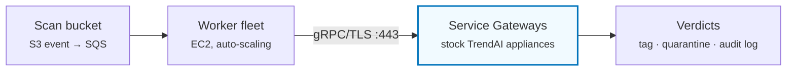
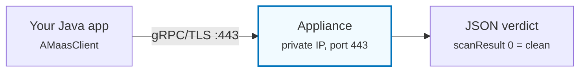
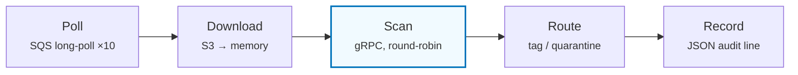

# TrendAI Vision One File Security on AWS — POC Guide

**Service Gateway virtual appliances · S3 malware-scanning pipeline**

Everything needed to evaluate Vision One File Security on Service Gateway virtual appliances: create the accounts, deploy the pipeline, prove it detects malware, connect your own application in Java, and tear it all down cleanly. Two CloudFormation stacks and one console click get you a running scanner.

| Phase | Sections |
|---|---|
| **Part I — Deploy** | [1. What you're evaluating](#1-what-youre-evaluating) · [2. Vision One setup](#2-vision-one-setup) · [3. AWS setup](#3-aws-setup) · [4. Deploy the scanner stack](#4-deploy-the-scanner-stack) · [5. Meet the watchdog](#5-meet-the-watchdog) · [6. Install File Security](#6-install-file-security) · [7. Deploy the worker stack](#7-deploy-the-worker-stack) |
| **Part II — Verify & Integrate** | [8. Prove it works](#8-prove-it-works) · [9. Success criteria](#9-success-criteria) · [10. Scan from your own code (Java)](#10-scan-from-your-own-code-java) |
| **Part III — Under the Hood** | [11. Inside the scanner application](#11-inside-the-scanner-application) · [12. SSM instead of SSH](#12-ssm-instead-of-ssh) · [13. Drift from the default deployment](#13-drift-from-the-default-deployment) · [14. Performance expectations](#14-performance-expectations) |
| **Part IV — Operate & Wrap Up** | [15. Day-to-day operation](#15-day-to-day-operation) · [16. Troubleshooting](#16-troubleshooting) · [17. Teardown](#17-teardown) · [18. Cost](#18-cost) · [19. References](#19-references) |

---

# Part I — Deploy

## 1. What you're evaluating

Files landing in an S3 bucket get scanned for malware automatically. Clean files are tagged and stay put; malicious files are tagged, copied to a quarantine bucket, and removed from the scan bucket. The pipeline is event-driven — verdicts typically land within seconds.



Scanning is done by TrendAI **Service Gateway virtual appliances** — stock AWS Marketplace AMIs running the File Security scanner. Your files are scanned **inside your VPC**; only scan metadata goes to TrendAI. The appliances are reached over gRPC/TLS on port 443, their documented scanner interface.

You deploy two independent stacks:

| Stack | Creates | Think of it as |
|---|---|---|
| `scanner.yaml` | VPC, 1–8 appliances, provisioner Lambda ("the watchdog"), secrets, VPC endpoints | The scanning *service* — reusable by any application |
| `worker.yaml` | Scan + quarantine buckets, SQS queue + DLQ, worker fleet, CloudWatch dashboard | A complete reference *application* driving the service |

### The architecture in one picture


### Complete resource inventory

| Stack | Group | Resources |
|---|---|---|
| `scanner.yaml` | Networking | VPC (10.2.0.0/16) · Internet Gateway · 2 public subnets · 2 NAT Gateways + EIPs · up to 8 private subnets (one per appliance) · route tables · VPC Flow Logs (all traffic, 30-day retention). All skipped in existing-VPC mode. |
| `scanner.yaml` | VPC endpoints | S3 (gateway) + 8 interface endpoints: SSM, SSMMessages, EC2Messages, Secrets Manager, SQS, CloudWatch Logs, STS, EC2 — with their security group |
| `scanner.yaml` | Appliances | 1–8 Service Gateway EC2 instances (c5.2xlarge default; stock Marketplace AMI; IMDSv2, encrypted EBS, termination protection) · launch template · security group (80/443/22 from the VPC CIDR, egress 443 only) · IAM role + instance profile (`AmazonSSMManagedInstanceCore`) |
| `scanner.yaml` | Provisioner | Watchdog Lambda (Python 3.12, 256 MB, X-Ray) · IAM role (SSM SendCommand scoped to stack-tagged instances) · EventBridge schedule rate(15 min) |
| `scanner.yaml` | Build | CodeBuild project (packages the watchdog from GitHub) · deploy bucket · one-shot trigger Lambda |
| `scanner.yaml` | Secrets | `appliance-v1fs/vision-one-api-key` · `…/sg-registration-token` (from parameters) · `…/sg-ca-cert` (created by the watchdog). Retained on stack deletion. |
| `worker.yaml` | S3 | Scan bucket (event notifications → SQS) · quarantine bucket — both AES256, HTTPS-only policies, all public access blocked |
| `worker.yaml` | Queue | SQS scan queue (SSE, long-polling) + dead-letter queue (after 5 receives) |
| `worker.yaml` | Workers | Auto Scaling group (t3.medium ×2–10) + launch template (IMDSv2, encrypted EBS) · SQS-depth step scaling · IAM role (S3 + SQS + Secrets read + audit logs + EC2 discovery) |
| `worker.yaml` | Observability | CloudWatch dashboard · alarms + SNS topic (KMS-encrypted) · `scan-audit-<stack>` log group |

Worth validating as you go: hands-free appliance provisioning ([§5](#5-meet-the-watchdog)), no SSH keys anywhere ([§12](#12-ssm-instead-of-ssh)), appliances running essentially stock TrendAI software ([§13](#13-drift-from-the-default-deployment)), and linear scaling — add appliances, get throughput ([§14](#14-performance-expectations)).

## 2. Vision One setup

Three things come out of this section: an account, an **API key**, and — timed right — a **registration token**.

### Create the account

Sign up for TrendAI Vision One (trial or licensed) with a business email. **Choose your data region carefully** — it determines where scan metadata is processed and cannot be changed later. Verify your email and sign in.

### Enable File Security

Console → *Cloud Security → File Security* → on first visit, click **Continue with Virtual Appliance**. Nothing else to configure here yet.

### Create the API key

| Step | Where |
|---|---|
| 1. Confirm a role exists with the **"Run file scan via SDK"** permission (create one if not) | *Administration → User Roles* |
| 2. Add an API key with that role; set a 30–90 day expiry | *Administration → API Keys → Add API Key* |
| 3. **Copy the key immediately** — it is shown once | You'll pass it to CloudFormation, which stores it in Secrets Manager |

> [!IMPORTANT]
> **The registration token expires after 24 hours — don't get it yet.** Generate it in [§4](#4-deploy-the-scanner-stack), immediately before deploying: *Workflow and Automation → Service Gateway Management → Download Virtual Appliance* → copy the **Registration Token**. (You are not downloading anything — the AMI comes from AWS Marketplace; the dialog is just where the token lives.)

## 3. AWS setup

| You need | Details |
|---|---|
| **Credentials** | A role that can create VPCs, EC2, IAM roles, Lambda, S3, SQS. Verify: `aws sts get-caller-identity` |
| **A region** | Pick one and stay in it. Defaults assume us-east-1 AZs — override `PrimaryAZ`/`SecondaryAZ` elsewhere. |
| **Marketplace subscription** | One-time, free: AWS Marketplace → search **"TrendAI Service Gateway BYOL"** → Subscribe → Accept terms. Without it, appliance launch fails with an authorization error. |
| **Staging bucket** | The templates exceed CloudFormation's inline limit: `aws s3 mb s3://<staging-bucket>` |

## 4. Deploy the scanner stack

> [!NOTE]
> **Evaluation sizing:** 2 appliances (c5.2xlarge) — enough to demonstrate load balancing with ~29M files/day of capacity, at roughly $17/day of EC2 cost. Scale to 8 later with a single stack update.

Get a **fresh registration token** ([§2](#2-vision-one-setup)), then:

```bash
# 1. Stage the template
aws s3 cp scanner.yaml s3://<staging-bucket>/scanner.yaml

# 2. Launch (~10–15 minutes to CREATE_COMPLETE)
aws cloudformation create-stack \
  --stack-name scanner-1 \
  --template-url https://s3.amazonaws.com/<staging-bucket>/scanner.yaml \
  --parameters \
    ParameterKey=ServiceGatewayCount,ParameterValue=2 \
    ParameterKey=VisionOneApiKey,ParameterValue="<api-key>" \
    ParameterKey=SGRegistrationToken,ParameterValue="<registration-token>" \
  --capabilities CAPABILITY_IAM \
  --disable-rollback

# 3. Watch the appliances progress through their lifecycle
aws ec2 describe-instances \
  --filters "Name=tag:appliance-v1fs:stack,Values=scanner-1" \
  --query 'Reservations[].Instances[].[Tags[?Key==`Name`]|[0].Value,
           Tags[?Key==`appliance-v1fs:registered`]|[0].Value,
           Tags[?Key==`appliance-v1fs:provisioned`]|[0].Value]' --output table
```

After the stack completes, hands-free provisioning begins — that's the watchdog's job, explained next.

> [!IMPORTANT]
> **Redeploying later? Three rules.** Always use a fresh, incrementing stack name (`scanner-2`, `scanner-3`…); always generate a fresh registration token; and delete leftover `appliance-v1fs/*` secrets first — they're retained on stack deletion, and a new stack fails with *AlreadyExists* if they linger (command in [§17](#17-teardown)).

## 5. Meet the watchdog

The **watchdog** is a small Lambda (`provisioner-<stack>`) that runs every 15 minutes and owns the entire appliance lifecycle. It's the reason this deployment needs no manual appliance setup: no console sessions, no SSH, no copy-pasting into terminals. If an appliance exists, the watchdog finds it, registers it, configures it, and keeps it configured.

On every pass, for every appliance (found by EC2 tag), it walks this state machine:

| Appliance state | What the watchdog does |
|---|---|
| **Not registered** | Sets the hostname (FSVA-AWS-01…) so it's identifiable in Vision One, then runs the appliance's own `register <token>` CLI command with the token from Secrets Manager — retrying, since fresh appliances need 1–3 minutes before accepting commands. Tags `registered=true`. |
| **Registered, no scanner yet** | Waits. File Security must be installed from the console ([§6](#6-install-file-security)) — the watchdog checks each pass for the scanner to appear. |
| **Scanner running, not provisioned** | Finishes the job: disables weak TLS ciphers (documented CLI command), extracts the appliance's TLS certificate into Secrets Manager, raises the upload size limit if the file-size parameter requires it, records the scanner version, tags `provisioned=true`. |
| **Fully provisioned** (steady state) | Health-checks each pass: re-applies the upload limit only if a scanner update reverted it, keeps the scan-cache setting consistent with the stack parameter, and re-extracts the certificate if the scanner version changed (in case it rotated). |

```bash
# Watch the watchdog work
aws logs tail /aws/lambda/provisioner-scanner-1 --follow

# Impatient? Trigger a pass now instead of waiting up to 15 minutes
aws lambda invoke --function-name provisioner-scanner-1 \
  --payload '{"action":"watchdog"}' /dev/stdout
```

> [!NOTE]
> **Why a watchdog instead of one-time provisioning?** Appliance updates arrive from Vision One on TrendAI's schedule, and an update can revert local configuration or rotate the TLS certificate. A one-shot provisioner would silently drift; a 15-minute reconciliation loop self-heals. It also makes scaling trivial — raise `ServiceGatewayCount` and new appliances are registered and provisioned automatically.

## 6. Install File Security

TrendAI requires the File Security service to be installed onto registered appliances from the Vision One console — there is no API for it. This is the only clicking you'll do:

| Step | Detail |
|---|---|
| 1. Wait for `registered=true` | [§4](#4-deploy-the-scanner-stack) watch command |
| 2. Open Service Gateway Management | *Workflow and Automation → Service Gateway Management* — appliances appear as **FSVA-AWS-01**, **-02**, … |
| 3. Install per appliance | Click the appliance → **Manage Services** → install **File Security Virtual Appliance** |
| 4. Wait for Healthy | A few minutes; then the watchdog finishes provisioning on its next pass — done when `provisioned=true` |

Timeline check: from `create-stack` to fully provisioned is typically **30–45 minutes** including one or two watchdog cycles.

## 7. Deploy the worker stack

```bash
aws s3 cp worker.yaml s3://<staging-bucket>/worker.yaml

aws cloudformation create-stack \
  --stack-name worker-1 \
  --template-url https://s3.amazonaws.com/<staging-bucket>/worker.yaml \
  --parameters ParameterKey=ScannerStackName,ParameterValue=scanner-1 \
  --capabilities CAPABILITY_IAM \
  --disable-rollback

# Bucket names and queue URL are in the outputs
aws cloudformation describe-stacks --stack-name worker-1 \
  --query 'Stacks[0].Outputs' --output table
```

Defaults are right for an evaluation: 2–10 t3.medium workers auto-scaling on queue depth, TLS on (the documented appliance endpoint), Predictive Machine Learning on, 500 MB max file size. Workers discover the appliances by EC2 tag — no endpoints to configure.

---

# Part II — Verify & Integrate

## 8. Prove it works

### A clean file, tagged in place

```bash
echo "hello scanner" | aws s3 cp - s3://<scan-bucket>/hello.txt
sleep 5
aws s3api get-object-tagging --bucket <scan-bucket> --key hello.txt
```

### Malware, quarantined

**EICAR** is the industry-standard test file: a harmless 68-byte string every antivirus deliberately detects. Pipe it straight to S3 — writing it to disk would set off your laptop's own antivirus:

```bash
printf 'X5O!P%%@AP[4\\PZX54(P^)7CC)7}$EICAR-STANDARD-ANTIVIRUS-TEST-FILE!$H+H*' \
  | aws s3 cp - s3://<scan-bucket>/eicar-test.txt
```

Within seconds:

| File | Outcome | Tagged |
|---|---|---|
| `hello.txt` | Stays in the scan bucket | **Clean** + ScanTimestamp |
| `eicar-test.txt` | Gone from the scan bucket; lands in quarantine at `<scan-bucket>/eicar-test.txt` | **Malware** |

And the audit log has the receipt:

```bash
aws logs tail scan-audit-worker-1 --since 5m
# → {"file":"eicar-test.txt","verdict":"malicious","malware":["Eicar_test_file"],
#    "scanDurationMs":38,"serviceGateway":"FSVA-AWS-01",...}
```

### A burst, on the dashboard

```bash
for i in $(seq 1 500); do
  echo "test file $i" | aws s3 cp - s3://<scan-bucket>/load/file-$i.txt &
done; wait
```

Open the stack's CloudWatch dashboard and watch queue depth spike and drain, scans/sec rise, and — the interesting one — per-appliance scan counts staying near 50/50.

> [!WARNING]
> **Testing with real malware?** Keep samples in S3 and move them with server-side copy only (`aws s3 cp s3://samples/… s3://<scan-bucket>/…`). Samples must never touch a workstation.

## 9. Success criteria

The evaluation passes when every row checks out:

| | Criterion | Evidence |
|---|---|---|
| ☐ | Both stacks reach `CREATE_COMPLETE` | CloudFormation |
| ☐ | Every appliance `registered=true` and `provisioned=true` within ~45 min of the File Security install — with zero appliance logins by you | EC2 tags ([§4](#4-deploy-the-scanner-stack)) |
| ☐ | Appliances visible and Healthy in Vision One | Service Gateway Management |
| ☐ | Clean file tagged `Clean` in ≤ 10 s, file untouched | [§8](#8-prove-it-works) |
| ☐ | EICAR removed, quarantined, tagged `Malware`, named detection in the audit log, in ≤ 10 s | [§8](#8-prove-it-works) |
| ☐ | 500-file burst drains with zero errors and an empty DLQ | Dashboard |
| ☐ | Scans balanced across appliances (±5%) | Dashboard / audit `serviceGateway` field |
| ☐ | Your own application gets correct verdicts via the SDK (clean = 0, EICAR ≠ 0) | [§10](#10-scan-from-your-own-code-java) |
| ☐ | Watchdog steady-state passes report `unchanged` | Provisioner logs |
| ☐ | (If in scope) throughput target met — [§14](#14-performance-expectations) for per-appliance expectations | Your load test |

## 10. Scan from your own code (Java)

The worker fleet is just a reference application — the real goal is your applications scanning directly. This section shows **Java**; the Python, Go, and Node.js SDKs follow the same pattern. Basic Java knowledge is enough — gRPC and File Security concepts are explained as we go. Facts verified against `file-security-java-sdk` 1.6.3.

### The picture

The scanner answers one question — *"is this file malicious?"* You send bytes, it returns a small JSON verdict. Transport is **gRPC** (remote procedure calls over HTTP/2), but you never write gRPC code — the SDK wraps it in one class:



### Add the SDK

The SDK is on Maven Central and needs Java 8 or newer.

**pom.xml**

```xml
<dependency>
  <groupId>com.trend</groupId>
  <artifactId>file-security-java-sdk</artifactId>
  <version>1.6.3</version>
</dependency>
```

**build.gradle**

```groovy
implementation 'com.trend:file-security-java-sdk:1.6.3'
```

### The constructor, annotated

One constructor does everything. For a Service Gateway appliance you pass its address as `host`; the region argument is ignored when a host is given:

```java
public AMaasClient(String region,      // "" — only used for Trend's cloud service
                   String host,        // the appliance, e.g. "10.2.3.45:443"
                   String apiKey,      // Vision One key with "Run file scan via SDK"
                   long   timeoutInSecs,  // per-scan deadline; 0 = default 180
                   boolean enabledTLS,    // true — 443 is the appliance's TLS endpoint
                   String caCertPath)  // PEM to trust, or null (see "TLS" below)
    throws AMaasException
```

### Connect once, scan many

**FirstScan.java**

```java
import com.trend.cloudone.amaas.AMaasClient;
import com.trend.cloudone.amaas.AMaasException;

public class FirstScan {
    public static void main(String[] args) {
        String apiKey = System.getenv("V1FS_API_KEY");   // same key the stack uses
        try {
            // 1. Connect ONCE. Appliance address = its private IP, port 443.
            AMaasClient client = new AMaasClient(
                    "", "10.2.3.45:443", apiKey, 300, true, null);
            try {
                // 2. Scan (blocks until the verdict; default limit 3 minutes)
                String resultJson = client.scanFile("/tmp/suspicious.pdf");
                System.out.println(resultJson);            // 3. the JSON verdict
            } finally {
                client.close();                            // 4. once, at shutdown
            }
        } catch (AMaasException e) {
            System.err.println("Scan failed: " + e.getMessage());
        }
    }
}
```

Constructing the client is the expensive part — it builds the gRPC *channel* (a managed HTTP/2 connection: one TCP + TLS handshake, like a phone line that stays open). Each scan then opens a cheap *stream* on that line. Your API key rides along automatically on every call.

### Reuse the connection — the one rule that matters

**Create one `AMaasClient` per appliance and keep it for the life of your application.** It is thread-safe; all your threads share it, and gRPC multiplexes their scans over the single connection.

```java
// GOOD — one client, shared by the whole app
public final class Scanner {
    private static final AMaasClient CLIENT = create();

    private static AMaasClient create() {
        try {
            return new AMaasClient("", System.getenv("SG_ADDR"),   // e.g. 10.2.3.45:443
                    System.getenv("V1FS_API_KEY"), 300, true, null);
        } catch (AMaasException e) {
            throw new IllegalStateException("Cannot reach the file scanner", e);
        }
    }
    public static String scan(byte[] b, String label) throws AMaasException {
        return CLIENT.scanBuffer(b, label);                // safe from any thread
    }
    public static void shutdown() { CLIENT.close(); }
}
```

> [!IMPORTANT]
> **Anti-pattern:** `new AMaasClient(...)` inside a request handler or loop. Every construction pays the full connection setup and leaks channels unless each is closed. One-scan-per-client code should be refactored.

> [!TIP]
> **How parallel can you go?** Each appliance runs up to **32 scans at once**; a pool of ~16–48 threads per appliance keeps it busy. Multiple appliances? One client each, round-robin. Discover them like the workers do: running EC2 instances tagged `appliance-v1fs:stack=scanner-1` — private IP, port 443.

When your application shuts down, close the client once to release the channel:

```java
Runtime.getRuntime().addShutdownHook(new Thread(() -> Scanner.shutdown()));
```

### Submit scans

Two methods cover nearly everything; both return the verdict as a JSON `String`. The `digest` flag matters more than it looks: it hashes the file so repeat scans of identical content hit the appliance's scan cache and return near-instantly — keep it `true`.

```java
// A file on disk
String json = client.scanFile(
    "/data/uploads/invoice.pdf",   // path
    true,                           // digest: hash so repeat scans hit the cache
    options);

// Bytes already in memory (an upload, a queue message, an S3 object)
byte[] payload = ...;
String json = client.scanBuffer(
    payload,
    "invoice.pdf",                  // identifier — shows up as fileName in the result
    true,
    options);
```

Options are built once and reused across calls:

```java
AMaasScanOptions options = AMaasScanOptions.builder()
    .pml(true)                     // predictive machine learning
    .activeContent(true)           // also flag PDF scripts and Office macros
    .verbose(false)                // true = much bigger, engine-level response
    .tagList(new String[]{"my-app"})  // up to 8 tags, visible in the console
    .build();
```

### TLS to the appliance

The appliance serves a self-signed certificate (for `*.sgi.xdr.trendmicro.com`). Two ways to deal with it:

| Approach | How | When |
|---|---|---|
| **Verify it** | Fetch the CA cert the watchdog stored in Secrets Manager (`appliance-v1fs/sg-ca-cert`), write it to a PEM file, pass its path as the constructor's last argument. Strict verification also checks the hostname, so this path needs a DNS name matching the certificate. | Across networks you don't fully control |
| **Trust it** | `export TM_AM_DISABLE_CERT_VERIFY=1` before starting the JVM — an official SDK switch. The connection stays encrypted; the server certificate just isn't authenticated. `caCertPath` may be null. | By-IP connections inside a private VPC you control |

> [!WARNING]
> This switch exists in the **Java** SDK only — the Python SDK has no equivalent (verified by test).

### Read the response

```jsonc
// Clean:
{ "scanId":"b1e3…", "scanResult":0, "scanTimestamp":"2026-07-13T18:04:11Z",
  "fileName":"quarterly-report.xlsx", "foundMalwares":[] }

// Malicious (EICAR):
{ "scanId":"2507…", "scanResult":1, "scanTimestamp":"2026-07-13T18:05:42Z",
  "fileName":"EICAR_TEST_FILE-1.exe",
  "foundMalwares":[ { "fileName":"Eicar.exe", "malwareName":"Eicar_test_file" } ] }
```

| Field | Meaning |
|---|---|
| `scanResult` | **The verdict:** `0` Clean · `1+` Malware (the count of detections). The first field to check — but see `foundErrors` below. |
| `foundMalwares` | One entry per detection — `malwareName` plus the `fileName` it was in (can be a file *inside* an archive) |
| `scanId` / `scanTimestamp` | Correlate with the Vision One console; log them |

### The subtle third case: clean, but not fully inspected

The scan engine enforces decompression limits to defend against zip bombs (archive nesting depth, file counts, expansion ratio and size — console-configurable, see [§15](#15-day-to-day-operation)). When an archive *exceeds* a limit, the scanner returns `scanResult: 0` — but includes a `foundErrors` array telling you it couldn't look inside everything:

```jsonc
{
  "scanResult": 0,                    // says clean…
  "fileName": "deep-archive.zip",
  "foundMalwares": [],
  "foundErrors": [
    { "name": "ATSE_MAXDECOM_ERR" }   // …but a nesting limit was hit
  ]
}
```

> [!CAUTION]
> Treat `scanResult 0` *plus a non-empty* `foundErrors` as "not fully scanned", never as clean.

| foundErrors name | Limit that was exceeded |
|---|---|
| `ATSE_MAXDECOM_ERR` | Archive nesting depth (zip inside zip inside zip…) — appliance default 20 layers |
| `ATSE_ZIP_FILE_COUNT_ERR` | Number of files inside one archive (unlimited by default; may be tightened in the console) |
| `ATSE_ZIP_RATIO_ERR` | Compression ratio — the classic zip-bomb signal (unlimited by default) |
| `ATSE_EXTRACT_TOO_BIG_ERR` | Decompressed size — appliance default 2048 MB per file |

### Parsing it — three ways out, not two

The SDK's `AMaasScanResult` bean doesn't carry `foundErrors`, so check it on the raw JSON:

```java
JsonObject r = JsonParser.parseString(resultJson).getAsJsonObject();

boolean hasMalware   = r.get("scanResult").getAsInt() > 0;
boolean fullyScanned = !r.has("foundErrors")
                     || r.getAsJsonArray("foundErrors").isEmpty();

if (hasMalware) {
    for (JsonElement m : r.getAsJsonArray("foundMalwares")) {
        log.warn("Detected {} in {}",
            m.getAsJsonObject().get("malwareName").getAsString(),
            m.getAsJsonObject().get("fileName").getAsString());
    }
    quarantine(file);
} else if (!fullyScanned) {
    review(file);     // clean verdict, but limits were hit — don't trust it blindly
} else {
    accept(file);
}
```

### When things go wrong

A detection is *not* an error — malicious files come back as normal responses. Exceptions (`AMaasException`) mean the scan couldn't complete:

| Message contains | Meaning | Action |
|---|---|---|
| "Authorization key cannot be authenticated" | Bad/expired key or missing role permission | Fix the key; don't retry |
| "gRPC status code: 14" (UNAVAILABLE) | Can't reach the scanner | Retry with backoff; check port 443 reachability |
| "gRPC status code: 4" (DEADLINE_EXCEEDED) | Timeout — default 3 minutes | Retry; raise `timeoutInSecs` for huge archives |
| "gRPC status code: 8" (RESOURCE_EXHAUSTED) | Scanner saturated or file too large | Backoff / lower concurrency |
| "Failed to load SSL certificate" | Bad `caCertPath` | Fix the PEM path |

A scan that throws is neither clean nor malicious — it's *unknown*. Retry only the three transient codes (14, 4, 8), with backoff, ~3 attempts; never treat an exception as a clean verdict.

### Complete working example

Connects once, scans a clean buffer and the EICAR test string, prints both verdicts, closes cleanly.

**ScanDemo.java**

```java
import com.trend.cloudone.amaas.AMaasClient;
import com.trend.cloudone.amaas.AMaasException;
import com.trend.cloudone.amaas.AMaasScanOptions;
import java.nio.charset.StandardCharsets;

public class ScanDemo {
    public static void main(String[] args) throws AMaasException {
        String sgAddr = System.getenv("SG_ADDR");      // appliance IP:443
        String apiKey = System.getenv("V1FS_API_KEY");

        // 1. Connect ONCE (by-IP: set TM_AM_DISABLE_CERT_VERIFY=1, see "TLS" above)
        AMaasClient client = new AMaasClient("", sgAddr, apiKey, 300, true, null);

        AMaasScanOptions options = AMaasScanOptions.builder()
            .tagList(new String[]{"scan-demo"})
            .build();

        try {
            // 2. A clean buffer
            byte[] clean = "hello, this is a harmless file".getBytes(StandardCharsets.UTF_8);
            System.out.println("clean → " + client.scanBuffer(clean, "clean.txt", true, options));

            // 3. The EICAR test string — split so this source file is never
            //    itself flagged by antivirus. Every engine detects the joined form.
            String eicar = "X5O!P%@AP[4\\PZX54(P^)7CC)7}$EICAR-STANDARD-"
                         + "ANTIVIRUS-TEST-FILE!$H+H*";
            byte[] mal = eicar.getBytes(StandardCharsets.UTF_8);
            System.out.println("eicar → " + client.scanBuffer(mal, "eicar.txt", true, options));
        } finally {
            // 4. Close ONCE, at shutdown
            client.close();
        }
    }
}
```

Expected output (trimmed):

```text
clean → {"scanResult": 0, "fileName": "clean.txt", "foundMalwares": [] …}
eicar → {"scanResult": 1, "fileName": "eicar.txt",
         "foundMalwares": [{"malwareName": "Eicar_test_file" …}] …}
```

---

# Part III — Under the Hood

## 11. Inside the scanner application

The worker fleet runs a single Python file — `app/scanner.py`, about 430 lines — and that's the entire application. It was kept deliberately small so an evaluator can read it in one sitting and adapt it with confidence.

### The whole thing in five steps



Everything else in the file is operational hygiene: a visibility-timeout heartbeat so slow scans aren't redelivered mid-flight, scan retries with backoff, appliance re-discovery every 60 seconds, and a SIGTERM handler that drains in-flight scans before exit so auto-scaling never kills work in progress.

### Built by elimination

Each design choice replaced something we tested and rejected — the simplicity is the result of removing machinery, not skipping it:

| Choice | What we tried first | Why the current design won |
|---|---|---|
| **Async, single event loop** (`amaas.grpc.aio` + aiobotocore) | Threads + the synchronous SDK | The sync path leaked OS threads under sustained load — 9,000+ observed. The async worker holds steady at ~a dozen threads for days. |
| **Direct-to-appliance, client-side round-robin**, discovery by EC2 tag | An ALB, then an NLB in front of the appliances | The ALB hit RESOURCE_EXHAUSTED and timeouts under load; the NLB coalesced connections onto one appliance. Direct was fastest *and* removed an infrastructure layer. Discovery is one EC2 API call. |
| **One reused gRPC handle per appliance** | Pools of channels, per-scan channels | HTTP/2 multiplexes concurrent scans over one connection; the appliance pins streams to one connection anyway. One handle is both optimal and the least code. |
| **Concurrency derived from capacity** — appliances × 32 handlers × 1.5, enforced by a semaphore | A hand-tuned fixed number | Fixed values under-used the fleet at one size and overloaded it at another. Deriving it means scaling the fleet retunes the workers automatically. |
| **Verdict routing as plain S3 calls** | — | Tag / copy / delete are three idempotent API calls; a redelivered message just repeats them safely. No state store needed. |

### Adapting it

The only business logic is the verdict-routing block inside `_process_file()` — roughly 30 lines covering three outcomes: clean (tag in place), malicious (tag, quarantine, delete), and *not fully scanned* (a decompression limit was hit — tagged `ScanResult=NotFullyScanned` and left in place, never marked Clean; the limit names land in the audit entry). To make the pipeline do something else on any of these, that block is the one place to edit. Discovery, TLS, concurrency, retries, and shutdown all keep working untouched. The module docstring at the top of `app/scanner.py` is the 20-line version of this section.

## 12. SSM instead of SSH

This deployment contains **no SSH keys at all**. Nothing generates one, nothing stores one, port 22 is never used. All appliance automation — registration, certificate extraction, configuration — runs through **AWS Systems Manager (SSM)**, and so does interactive access when a human needs a shell.

### How it works

The TrendAI appliance AMI ships with the SSM agent pre-installed. The scanner stack attaches an IAM instance profile that lets the agent check in with the SSM service through a VPC endpoint. From then on:

```bash
# Automation: the watchdog runs commands via SSM RunCommand — no inbound path needed
# Humans: a shell on any instance, from anywhere your AWS credentials work
aws ssm start-session --target <instance-id>
```

### Easier than SSH

| With SSH | With SSM |
|---|---|
| Generate a key pair, distribute the private key, protect it, rotate it, revoke it when people leave | No keys exist. Access = your normal AWS credentials |
| Open port 22, maintain a bastion or VPN path into private subnets | No inbound ports; the agent connects outward via a VPC endpoint |
| Appliance root access is a documented multi-step procedure (generate an RSA key, install it via the appliance CLI, SSH as a special user, `sudo`) | One API call runs the command with the needed privileges |

### More secure than SSH

| Property | Why it matters |
|---|---|
| **No long-lived secrets** | SSH private keys are bearer credentials that never expire and travel badly. SSM uses your short-lived, MFA-able IAM session. |
| **Least privilege, enforced by policy** | The watchdog's permission is scoped to one SSM document (`AWS-RunShellScript`) and only to instances tagged as its own stack. A leaked worker credential can't touch the appliances. |
| **Every action audited** | Each RunCommand and shell session lands in CloudTrail — who, what, when, on which instance. SSH gives you none of that centrally. |
| **Smaller attack surface** | No listening SSH daemon exposed beyond the VPC, no port-22 noise, no bastion to harden and patch. |

Trade-off, stated honestly: SSM commands run as root via AWS's agent rather than through TrendAI's documented SSH procedure — same access level, different (and undocumented) transport. See the drift table below.

## 13. Drift from the default deployment

This project deliberately stays as close as possible to the deployment TrendAI documents and supports. The appliances are stock Marketplace AMIs; scanning uses the official SDK against the documented gRPC/TLS endpoint; registration uses the documented CLI command; File Security is installed the documented way (console); decompression scan policy is configured the documented way (console). Every remaining deviation is listed here — nothing else is modified.

| # | Deviation | Why | Posture |
|---|---|---|---|
| 1 | **Automation transport: SSM RunCommand (as root)** instead of interactive SSH; hostname set with `hostnamectl` (docs only cover the CLI `configure endpoint`) | Hands-free provisioning, no key management, full audit trail ([§12](#12-ssm-instead-of-ssh)) | Method drift only — the commands run are the documented ones; TrendAI's own KB provides an equivalent root path via SSH |
| 2 | **nginx upload-limit patch.** The appliance's ingress defaults to 10 MB request bodies, blocking gRPC scans of larger files; the watchdog raises it to `MaxFileSizeMB` — only when the live value differs | Without it, files >10 MB fail to scan, while the product supports far larger files | The one true modification of appliance internals. Self-heals if an update reverts it. Flagged for re-test on current builds — if TrendAI has raised the default, this disappears |
| 3 | **Scan-cache override — only when disabled.** The appliance default (cache on) is untouched; `ScanCacheEnabled=false` applies an env override for worst-case benchmarking | Honest baseline numbers during testing | No override in normal operation; uses an internal variable when engaged |
| 4 | **TLS certificate extraction.** The watchdog reads the certificate the appliance serves (`openssl s_client`) into Secrets Manager | Python SDK clients can only trust the appliance via an explicit CA file — there is no "accept the appliance cert" switch in Python (verified by test; Java has one) | Read-only — nothing on the appliance changes. The cert feeds the SDK's documented `ca_cert` input |
| 5 | **TLS hostname handling.** Workers connect by IP and present the certificate's own name via a gRPC override (SNI), instead of creating DNS records matching the cert's wildcard | Avoids replicating a trendmicro.com domain in private DNS | Client-side only; certificate verification stays strict against the extracted CA |
| 6 | **A plaintext fallback exists.** `EnableTLS=false` switches workers to gRPC h2c on port 80 — an undocumented interface | Troubleshooting aid | Never the default; don't use beyond debugging |

**Explicitly untouched** (all appliance defaults): scanner pod replica count, concurrency (`TM_AM_MAX_HANDLER`), container images (updated by TrendAI via Vision One), Redis, MicroK8s/networking, storage sizing. The watchdog enforces nothing that matches a default — it only corrects genuine deviations.

## 14. Performance expectations

Benchmarked on this exact architecture — 7,159 unique real-world malware samples, 103,506 scans, cache *disabled* (worst case):

| Metric | Measured (2× c5.2xlarge appliances) |
|---|---|
| Sustained throughput | **339 scans/s** (29.3M files/day) |
| Peak | 402 scans/s |
| Latency p50 / p90 / p99 | 47 ms / 1.6 s / 2.2 s |
| Appliance balance | 50.0% / 50.0% |
| Errors / DLQ | 0 / 0 |

Scaling is linear at ~170 scans/s per appliance: 1 ≈ 14.7M files/day · 4 ≈ 58.7M · 8 ≈ 117M. In production the scan cache stays on (appliance default), so repeated file hashes return near-instantly and real throughput runs higher than these floors. Bigger instances don't help — the scanner's concurrency is fixed per appliance. **Scale out, not up.**

---

# Part IV — Operate & Wrap Up

## 15. Day-to-day operation

| Task | How |
|---|---|
| Steady state | Hands-off. The watchdog reconciles every 15 minutes; appliance updates arrive from Vision One automatically and configuration is re-verified afterward. |
| Scale the fleet | Update `ServiceGatewayCount` (1–8). New appliances self-register; install File Security on them ([§6](#6-install-file-security)); workers notice within 60 s and rebalance. |
| Tune scan policy | Archive depth/ratio/count/size limits: Vision One → *File Security → Virtual Appliance* — the documented console knobs. |
| Watch the pipeline | The CloudWatch dashboard · `scan-audit-<worker-stack>` (one JSON line per scan) · `/aws/lambda/provisioner-<scanner-stack>` (watchdog) · SSM Session Manager for a shell anywhere. |

## 16. Troubleshooting

| Symptom | Likely cause | Fix |
|---|---|---|
| Appliances fail to launch (authorization error) | No Marketplace subscription | Subscribe ([§3](#3-aws-setup)), redeploy |
| Never `registered=true` | Registration token expired (24 h) or appliance still booting | Fresh token, new stack name; allow 1–2 watchdog cycles |
| `registered=true` but never `provisioned=true` | File Security not installed via console | [§6](#6-install-file-security), then one watchdog cycle |
| Files sit untagged in the scan bucket | Appliances not provisioned, or workers can't discover them | Check both tags; dashboard queue depth; worker logs via SSM session |
| Small files scan, >10 MB files fail | Appliance upload limit reverted by an update | Self-heals within 15 min; or trigger the watchdog and check its log |
| SDK client: immediate UNAVAILABLE | No route/SG rule to port 443, or TLS trust problem | Verify reachability from your subnet; re-read [§10](#10-scan-from-your-own-code-java) |
| Messages in the DLQ | A file failed scanning 5 times | Inspect the message; check size vs `MaxFileSizeMB`; scan manually via SDK |
| New stack fails: secret *AlreadyExists* | Retained secrets from a previous stack | Delete them ([§17](#17-teardown) step 6), redeploy |

## 17. Teardown

In this order — steps 3 and 6 are the ones people miss:

```bash
# 1. Empty both buckets (CloudFormation can't delete non-empty buckets).
#    Batched deletes, parallel by prefix — never `aws s3 rm --recursive` at scale.
aws s3api list-objects-v2 --bucket <bucket> --query 'Contents[].Key' --output text \
 | tr '\t' '\n' | split -l 1000 - /tmp/keys.
for f in /tmp/keys.*; do
  aws s3api delete-objects --bucket <bucket> \
    --delete "$(printf '{"Objects":[%s]}' "$(sed 's/.*/{"Key":"&"}/' $f | paste -sd, -)")" &
done; wait

# 2. Delete the worker stack
aws cloudformation delete-stack --stack-name worker-1

# 3. Disable termination protection on the appliances (enabled on purpose —
#    scanner stack deletion fails otherwise)
for id in $(aws ec2 describe-instances \
    --filters "Name=tag:appliance-v1fs:stack,Values=scanner-1" \
              "Name=instance-state-name,Values=running" \
    --query 'Reservations[].Instances[].InstanceId' --output text); do
  aws ec2 modify-instance-attribute --instance-id $id --no-disable-api-termination
done

# 4. Delete the scanner stack
aws cloudformation delete-stack --stack-name scanner-1

# 5. Vision One console: Service Gateway Management → disconnect (trash) each appliance

# 6. Delete the retained secrets — required before any future deployment
for s in vision-one-api-key sg-registration-token sg-ca-cert; do
  aws secretsmanager delete-secret --secret-id appliance-v1fs/$s \
    --force-delete-without-recovery
done
```

## 18. Cost

| Configuration | Compute | Monthly | ~Daily |
|---|---|---|---|
| Evaluation (this guide) | 2× c5.2xlarge + 2–10 t3.medium workers | ≈ $740 | ≈ $25 |
| Production reference (24M+ files/day) | 6× c5.2xlarge + 8 workers | ≈ $1,732 | ≈ $58 |

EC2 only; VPC endpoints, NAT, S3/SQS/CloudWatch add modest usage-based charges. A two-week evaluation at the 2-appliance size lands around $350–400 all-in. Tear down promptly ([§17](#17-teardown)).

## 19. References

Every public resource that pertains to deploying the File Security Virtual Appliance on AWS, verified live July 2026.

> [!NOTE]
> **Browser recommended for docs.trendmicro.com links** — that site answers non-browser clients (curl, fetch tools) with a self-referencing redirect, so scripted fetches appear to hang. The pages load normally in a browser.

### TrendAI — Service Gateway appliance

| Resource | What it covers |
|---|---|
| [Service Gateway appliance system requirements](https://docs.trendmicro.com/en-us/documentation/article/trend-vision-one-service-gateway-sys-req) | Standard/minimal image specs; supported platforms incl. AWS C5/C6/C7 series; per-service resource table |
| [Deploy a Service Gateway virtual appliance with AWS](https://docs.trendmicro.com/en-us/documentation/article/trend-vision-one-for-mea-deploy-service-gateway-aws) | The official AWS walkthrough: Marketplace BYOL AMI, instance type selection, security group ports, registration |
| [Deployment guides (index)](https://docs.trendmicro.com/en-us/documentation/article/trend-vision-one-deployment-guides) | All platform deployment guides (VMware, Hyper-V, AWS, Azure, …) |
| [Getting started with Service Gateway](https://docs.trendmicro.com/en-us/documentation/article/trend-vision-one-getting-started-service-gateway) | Topology mapping, requirements, deployment planning |
| [Service Gateway Management](https://docs.trendmicro.com/en-us/documentation/article/trend-vision-one-service-gateway-management) | The console app: appliance details, Manage Services, storage, certificates, API keys |
| [Service Gateway CLI commands](https://docs.trendmicro.com/en-us/documentation/article/trend-vision-one-service-gateway-cli-commands) | The documented clish surface: `register`, `configure endpoint/network/storage`, cipher hardening, verification commands |
| [Vision One API keys](https://docs.trendmicro.com/en-us/documentation/article/trend-vision-one-api-keys) | Creating and managing the API key the SDK authenticates with |

### TrendAI — File Security & the Virtual Appliance

| Resource | What it covers |
|---|---|
| [File Security (introduction)](https://docs.trendmicro.com/en-us/documentation/article/trend-vision-one-file-security-intro-origin) | Product overview: SDK, Storage, and Virtual Appliance scanning |
| [File Security Virtual Appliance](https://docs.trendmicro.com/en-us/documentation/article/trend-vision-one-file-security-virtual-appliance) | FSVA overview; NFS3/NFS4 and SMB 3.0/3.1 mount-point scanning |
| [Deploy a Virtual Appliance from File Security](https://docs.trendmicro.com/en-us/documentation/article/trend-vision-one-deploying-va-fs) | Installing FSVA onto a Service Gateway from the console ([§6](#6-install-file-security) of this guide) |
| [Configure file scan policy settings](https://docs.trendmicro.com/en-us/documentation/article/trend-vision-one-fs-va-compressed-file-scan-settings) | The decompression limits behind `ATSE_*` errors: layer, ratio, file count, size — defaults and impacts |
| [Virtual Appliance support for ICAP scan](https://docs.trendmicro.com/en-us/documentation/article/trend-vision-one-virtual-appliance-support-icap-scan) | The ICAP interface: `icap://<host>:31344/avscan`, methods, PML query param, response codes |
| [FSVA expanded scanning capabilities (What's New)](https://docs.trendmicro.com/en-us/documentation/article/trend-vision-one-fsva-expanded-scanning-capabilities) | March 2026 announcement of ICAP support and scan-policy configuration |
| [Configure the Virtual Appliance for ONTAP agent support](https://docs.trendmicro.com/en-us/documentation/article/trend-vision-one-configure-fs-va-for-ontap) | Documents the built-in scanner endpoint: gRPC over TLS, port 443, out of the box |
| [File Security SDK](https://docs.trendmicro.com/en-us/documentation/article/trend-vision-one-sdk-or-cli-scanning) | SDK/CLI scanning overview: languages, TLS, features |
| [Use the SDK](https://docs.trendmicro.com/en-us/documentation/article/trend-vision-one-using-sdk) | SDK client tools, flags, tag limits |
| [TrendAI Vision One platform](https://www.trendmicro.com/en_us/business/products/one-platform.html) | Product page — account signup starts here |

### TrendAI — support knowledge base

| Resource | What it covers |
|---|---|
| [KA-0014380 — Log in to Service Gateway with root permission](https://success.trendmicro.com/en-US/solution/KA-0014380) | The sanctioned SSH root path (sgowner) — the manual equivalent of what our SSM automation does |
| [KA-0022161 — Log in using the sgowner root user (PuTTY)](https://success.trendmicro.com/en-US/solution/KA-0022161) | Windows/PuTTY variant of the same procedure |
| [KA-0013912 — Dual network card configuration](https://success.trendmicro.com/en-US/solution/KA-0013912) | clish network commands for multi-NIC appliances |

### File Security SDKs

| Resource | What it covers |
|---|---|
| [Java SDK (GitHub)](https://github.com/trendmicro/tm-v1-fs-java-sdk) · [Maven Central](https://central.sonatype.com/artifact/com.trend/file-security-java-sdk) | `com.trend:file-security-java-sdk` — the SDK used in [§10](#10-scan-from-your-own-code-java); user guide in the repo README |
| [Python SDK (GitHub)](https://github.com/trendmicro/tm-v1-fs-python-sdk) · [PyPI](https://pypi.org/project/visionone-filesecurity/) | `visionone-filesecurity` — used by this project's worker application |
| [Go SDK (GitHub)](https://github.com/trendmicro/tm-v1-fs-golang-sdk) | Same client model in Go |
| [Node.js SDK (GitHub)](https://github.com/trendmicro/tm-v1-fs-nodejs-sdk) | Same client model in Node.js |

### AWS services used by this deployment

| Resource | What it covers |
|---|---|
| [AWS Marketplace — TrendAI Service Gateway BYOL](https://aws.amazon.com/marketplace/search/results?searchTerms=TrendAI+Service+Gateway) | The appliance AMI subscription ([§3](#3-aws-setup) prerequisite) |
| [AWS Systems Manager Session Manager](https://docs.aws.amazon.com/systems-manager/latest/userguide/session-manager.html) | Keyless interactive shell access ([§12](#12-ssm-instead-of-ssh)) |
| [AWS Systems Manager Run Command](https://docs.aws.amazon.com/systems-manager/latest/userguide/run-command.html) | The mechanism behind the watchdog's appliance automation ([§5](#5-meet-the-watchdog), [§12](#12-ssm-instead-of-ssh)) |
| [IAM roles for Amazon EC2](https://docs.aws.amazon.com/AWSEC2/latest/UserGuide/iam-roles-for-amazon-ec2.html) | Instance profiles — how the appliances get SSM access without credentials |
| [Amazon S3 Event Notifications](https://docs.aws.amazon.com/AmazonS3/latest/userguide/EventNotifications.html) | The S3 → SQS trigger that starts every scan |

### Testing

| Resource | What it covers |
|---|---|
| [EICAR anti-malware test file](https://www.eicar.org/download-anti-malware-testfile/) | The standard harmless detection-test string used in [§8](#8-prove-it-works) and [§10](#10-scan-from-your-own-code-java) |

---

*Sources: SDK facts verified against `com.trend:file-security-java-sdk` 1.6.3 and the Python `visionone-filesecurity` sources; TLS-bypass behavior confirmed by local test (July 2026). Benchmarks: stack-51 run, real-world samples, cache disabled. All reference URLs verified live 2026-07-13.*
